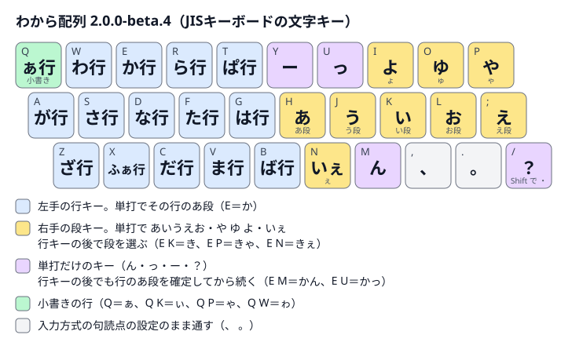

# わから配列 v2 — 公開ベータ

左手で行を、右手で段を選ぶ日本語入力配列です。`W E R` + Enter で「わから」、`E K` で「き」になります。
このリポジトリが配列仕様と練習教材の正本です。**配列 2.0.0-beta.3 / 練習帳 0.3.0** を提供します。

## 2.0.0-beta.3 の配列



- **左手のキーは行**です。単打でその行のあ段になります（`E` か、`S` さ、`A` が、`T` ぱ、`X` ふぁ、`Q` ぁ）。
- **右手の `H` `K` `J` `;` `L` と `P` `O` `I` は段**です。行キーの後の `H` `K` `J` `;` `L` で あいうえお段、`P` `O` `I` で ゃゅょ段になります（`E K` き、`E P` きゃ、`E I` きょ）。単打では あ い う え お と や ゆ よ です。
- **`U` と `N` は ん**、`M` は っ、`Y` は ー、`/` は ？、Shift+`/` は ・ です。行キーの後に打つと、行のあ段を確定してから続きます（`E U` かん、`E Y` かー）。
- 小書きは `Q` の行（`Q K` ぃ、`Q P` ゃ、`Q W` ゎ）、ゔ は `W J` の行（`W J H` ゔぁ）です。記号・矢印は **`Q` `Q` の後に1打**です（`Q Q L` →、`Q Q A` ※）。

すべての組み合わせは[配列表](docs/layout-v2.md)の「行と段の組み合わせ」（五十音順の表）と「全規則」にあります。

### 2.0.0-beta.2 からの変更

| キー | 2.0.0-beta.2 | **2.0.0-beta.3** |
| --- | --- | --- |
| `U` | や（行キーの後は ゃゅょ の ゃ） | **ん**（`N` と同じ） |
| `P` | 記号・矢印の前置。行キーの後は特殊列（こと・です・しぇ など） | **や**（行キーの後は ゃ。`E P` きゃ） |
| 記号・矢印 | `P` の後に1打（`P L` →） | **`Q` `Q` の後に1打**（`Q Q L` →。後ろのキーは同じ） |
| ゎ | `Q P` | **`Q W`** |
| 特殊列（14規則） | こと ので はい ます れる わけ がい です ぶん ぷろ して しぇ ちぇ じぇ | **廃止**。かな1つずつ打つ（しぇ は `S K Q ;`） |

ほかのキーは2.0.0-beta.2と同じです（`N` ん、`M` っ、`Y` ー、`/` ？、`I` よ、`O` ゆ、が行 `A`、ぱ行 `T`）。規則は233から220になりました。
変更の理由と規則IDの対応は[v2の対応と違い](docs/compatibility.md#200-beta3-での変更)にあります。

**[ブラウザでわから配列を体験する](https://yuhkis.github.io/wkr-layout/)** — アプリのインストール不要。ABC・英数で、いつものQWERTYキーボードから試せます。

[配列2.0.0-beta.3の配布zipとSHA256SUMS](https://github.com/yuhkis/wkr-layout/releases/tag/v2.0.0-beta.3)は公式Releaseにあります。以前の[2.0.0-beta.2](https://github.com/yuhkis/wkr-layout/releases/tag/v2.0.0-beta.2)（U＝や、P＝記号前置と特殊列、練習帳0.2.1）と[2.0.0-beta.1](https://github.com/yuhkis/wkr-layout/releases/tag/v2.0.0-beta.1)（ん＝M、っ＝N、練習帳0.1.0）のReleaseも残しています。練習帳は0.2.0でQWERTY体験を追加しました。

## 初めて使う方へ

1. [ブラウザデモ](https://yuhkis.github.io/wkr-layout/)を開き、ABC・英数に切り替えて「QWERTYで体験」を選びます。Hで「あ」、E→Kで「き」を入力できます。WKR導入済みの方は「WKR・IMEで練習」を選び、普段のひらがな入力でも練習できます。
2. [配列表](docs/layout-v2.md)で基本キーを確認します。練習は母音・行キーから短文へ進みます。
3. 実際の文章入力には [WKR macOS v2 Public Beta 0.8.0-public.beta.5](https://github.com/yuhkis/wkr-macos/releases/tag/v0.8.0-public.beta.5) とApple日本語入力を使います。このアプリは配列2.0.0-beta.1（ん＝M、っ＝N、U＝や、P＝記号前置）のままで、2.0.0-beta.3に対応した版は未公開です。[実装の違い](docs/compatibility.md)も確認してください。

練習アプリは既定では成績を保存しません。「成績をこの端末に保存」を有効にした場合だけ課題別の完了回数・最高正答率を保存します。入力本文・誤入力・キー列・時刻は保存しません。[保存と削除](practice/README.md)を参照してください。

## v2 の仕様と版

- [220規則の正本JSON](data/layout-v2.json)と[生成した配列表](docs/layout-v2.md)（キー配置の図と五十音順の表つき）。
- [Google日本語入力 v2テーブル](v2/google-japanese-input/romantable.txt)、[azooKey v2テーブル](v2/azookey/custom_input_table.tsv)。各IMEでの実入力は未確認です。
- [v1からの変更・既知の差](docs/compatibility.md)。v1.1資料は[保存版](docs/v1.md)、ルート直下のIMEテーブルはv1.1のままです。仕様zipにも同梱し、以前のReleaseへアクセスせず参照できます。v2と混在させないでください。
- 配列版と練習版は独立しています。WKR macOSは別リポジトリ・別バージョンです。同じ版名の内容は差し替えず、変更時は版を上げます。

## v1の記録

v1系の最終版の説明・配列表・IMEテーブルは、[v1.1.0 保存資料のRelease](https://github.com/yuhkis/wkr-layout/releases/tag/v1.1.0-archive.1)にまとめています。旧v1.1.0のGoogle日本語入力・azooKeyテーブルを変更せずに収録し、[v1の資料](docs/v1.md)でv1.0からの変更履歴も参照できます。

対応するmacOS実装は[WKR macOS 0.7.0 保存ソース](https://github.com/yuhkis/wkr-macos/releases/tag/v0.7.0-archive.1)です。

保存資料のタグは `v1.1.0-archive.1`、配列の版は `1.1.0` です。アプリ・練習は含みません。現行WKR macOS v2 Public Betaと練習帳はv2用です。

## 開発

Python 3（標準ライブラリのみ）で生成・検査できます。

```sh
python3 scripts/generate.py
python3 scripts/generate.py --check
python3 -m unittest discover -s tests
node --test practice/*.test.cjs
```

使い方と構成は [scripts/README.md](scripts/README.md)、教材とブラウザ版は [practice/README.md](practice/README.md)へ。
教材を変えたら練習版、規則を変えたら配列版を更新し、WKR macOS側の同期スクリプトで固定commitから取り込みます。
[公開ベータの検証記録](docs/verification.md)と[Release文案](docs/release-2.0.0-beta.3.md)に確認範囲を残します。

MIT License — [LICENSE](LICENSE)。背景と従来版の説明は[v1資料](docs/v1.md)に残しています。

練習帳ZIPは `python3 scripts/package.py` でcleanなcommitから `build/distribution/<commit>/` へ作成します。Webサイトは `python3 scripts/package-site.py` で固定の9ファイルだけを `build/site/<commit>/public/` と `site.zip` へ生成します。公開済みの配布物は置き換えません。[検証記録](docs/verification.md)と[公開前監査](docs/publication-audit.md)の未確認・保留事項を先に確認してください。

公開作業を始めるときは `python3 scripts/publication_guard.py install` で、このリポジトリだけのpush前ガードを設置します。接続先のrepository IDと監査済みの内容に対する承認が揃うまではpushを拒否します。[公開前監査](docs/publication-audit.md)に監査と承認記録の手順があります。

v1.1の保存用配布物は `python3 scripts/package-v1-archive.py` で作成します。固定した旧テーブルのSHA256を検査し、`build/distribution/v1.1.0-archive.1/<commit>/` にzip・manifest・SHA256SUMSを出力します。詳細は [scripts/README.md](scripts/README.md) を参照してください。

## 個人情報を入れない継続設定

公開作業では毎回、専用Gitに `python3 scripts/publication_guard.py install --repository-id ID` で検査を設置します。pre-commitは作業ファイルではなくstage済みの全ファイルと著者情報、commit-msgは本文を検査し、許可外メール・ローカルパス・秘密情報・私的記録を含むcommitを拒否します。既存のpre-pushも維持します。未設置・検査失敗・由来不明は公開停止とし、`--no-verify`やhookの無効化で回避しません。

`check-index` で同じ検査を手動実行できます。`check-assets --file PATH` は生成したZIP・本文を検査しますが、アップロード承認にはなりません。Pagesも `authorize --operation pages` と `check-upload --operation pages --file PATH` の対象です。アプリ・サイトは固定の収録リストから作り、実データ・個人設定・監査原記録をコピーしません。検出語はログへ出しません。自動検査に加えて出所と内容を確認し、未検出を「個人情報ゼロ」の証明とは扱いません。

## Webデモの公開

公開先は https://yuhkis.github.io/wkr-layout/ 。GitHub PagesはGitHub Actions方式で配信します。公開するmainのcommitからサイトを生成・監査し、手動workflowに `site_sha256` を指定すると、同じ内容のサイトだけを配信します。pushやPRではサイトを自動公開しません。手順は[scripts/README.md](scripts/README.md)を参照してください。
