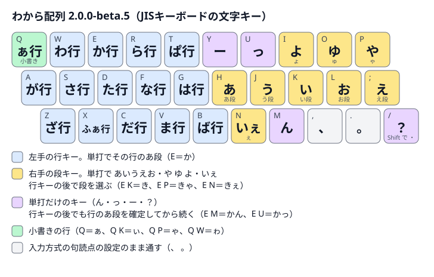

# Release情報 — わから配列 2.0.0-beta.5 / 練習帳 0.5.0（公開候補）

左手で行、右手で段を選ぶ日本語入力配列です。今回の変更は、**Dをた行、Fをな行へ入れ替えること**です。単打は `D` た・`F` な、行キーの後は `D K` ち・`F K` に、`D N` ちぇ・`F N` にぇになります。

20規則の出力・ローマ字綴り・規則IDを更新しました。ほかの151規則とキー列の集合・並び順は2.0.0-beta.4と同じで、全171規則です。`M` ん、`U` っ、`N` いぇ・ぇの段、`P` や・ゃの段も同じです。専用の記号・矢印・短縮列はありません。

[配列表](layout-v2.md)に全規則、[対応と変更の詳細](compatibility.md#200-beta5-での変更)に20件の規則ID対応を掲載しています。

## 練習帳と配布物

練習帳0.5.0では、11課題の目標かなを保ち、教材の綴り・キー図・説明を新しいD/F配置へ合わせます。初めて使う方向けの基本キーから短文へ進む構成で、v1からの移行練習は補助です。QWERTYでページ内変換を体験するモードと、WKR・IMEで確定したひらがなを練習するモードを選べます。

予定する添付: `wakara-layout-2.0.0-beta.5.zip`、`wakara-practice-0.5.0.zip`、`manifest.json`、`SHA256SUMS`。練習帳ZIPは展開して `practice/index.html` を開くとオフラインで使えます。Google日本語入力・azooKeyのv2テーブルも同じ正本から生成します。

[公開済みのWebデモ](https://yuhkis.github.io/wkr-layout/)は現在、配列2.0.0-beta.4 / 練習帳0.4.0です。候補の配信更新は未実施です。

成績保存は既定でオフです。有効にした場合だけ、課題別の完了回数・最高正答率を端末内に保存します。入力本文・誤入力・キー列・日時を保存・送信しません。配列版ごとに保存先を分け、以前の版の成績は自動移行しません。[保存と削除](../practice/README.md#保存と削除)で説明しています。

## macOSアプリと確認範囲

公開済みの[WKR macOS v2 Public Beta 0.8.0-public.beta.5](https://github.com/yuhkis/wkr-macos/releases/tag/v0.8.0-public.beta.5)は配列2.0.0-beta.1 / 練習帳0.1.0です。この配列への対応アプリは別リポジトリで準備します。練習時は入力側と教材側の配列版をそろえてください。

生成一致検査・PythonとNodeの検査は[検証記録](verification.md)に記載します。Google日本語入力・azooKeyでの実入力、今回の公開候補と実機WKR・Apple日本語入力の組み合わせは未確認です。以前の版の動作確認を、今回の配布物の実機確認とは扱いません。

v1.1の保存資料と旧IMEテーブルは保持します。公開済みの版・タグ・配布ファイルを置き換えません。
